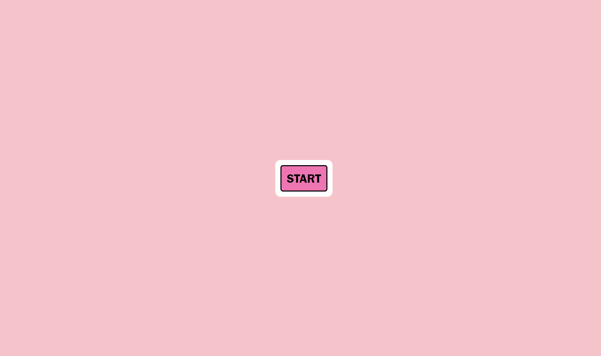

# JavaScript: Quiz

## Description
I have attempted to create an interactive JavaScript quiz utilizing original HTML, CSS, and JavaScript elements. This project intends to showcase the skills that I have learned in JavaScript. This webpage features an EventListener() on the start button, prompting the quiz to begin by presenting the first question and starting a timer. The answer buttons are interactive. The timer is affected by the user's answer choices. When the timer runs out, the endGame() functions are run to alert the user that the game is over, and providing an area for the user to input their initials to be displayed on the HighScore board. The initials and score are saved in local storage, which can be seen when you inspect the page. Throughout development, I learned the complexity of creating multiple interactive elements on one webpage.

## Installation

This webpage can be accessed on Github Pages, at the link: https://gwenparadis.github.io/04-js-quiz/

## Usage

Once the webpage has been accessed using the Installation guidelines above, the user can hover their cursor over the "START" button and click to run the startGame function, starting the timer and revealing the first question. The user can click the answer options provided to affect the score, and automatically move to the next question. When the timer runs out or the questions are completed, the game is over and the user is alerted. The user can enter their initials into the input box, and when the user clicks submit, they will see their initials displayed on the webpage, concatenated with their earned score.

## Credits

NA

## License

NA
